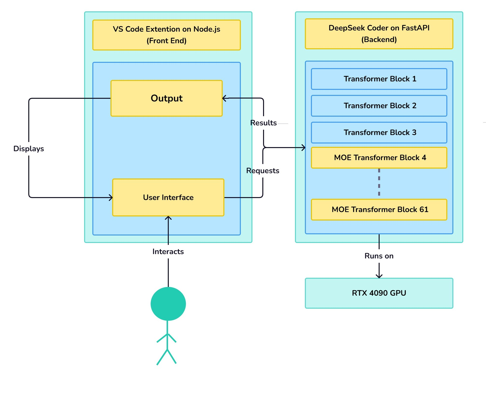
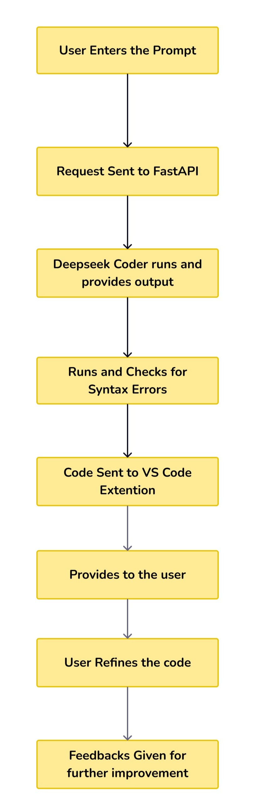

# **CodeGenie**

## Introduction

CodeGenie is an **AI-powered coding** assistant designed to revolutionize the software development process. It **utilizes DeepSeek Coder** to provide intelligent code suggestions, detect errors, and enhance overall coding efficiency all the while maintaining high-quality standards.

Being a flexible **friend for developers** working on web development, data science, machine learning, and other software apllications, the tool **supports several programming languages and frameworks**. CodeGenie improves efficiency without interfering with the developer's workflow thanks to a substantially interactive interface and flawless **integration into a well-known IDE like VS Code**.

### **Purpose**

The primary goal of CodeGenie is to streamline the coding process by offering:

- Context-aware code suggestions
- Error detection and correction
- Code optimization
- Support for multiple programming languages and frameworks

By integrating AI into the development workflow, CodeGenie aims to boost efficiency and improve code quality.

### **Applications**

CodeGenie can be used in various software development scenarios, including:

- **Web Development**: Assisting in writing front-end and back-end code

- **Machine Learning & Data Science**: Generating model scripts and preprocessing code

- **Software Engineering**: Automating repetitive tasks and improving coding standards

- **Debugging & Optimization**: Identifying and fixing errors quickly

- **Suggests best practices for efficient and maintainable code**

## Architecture Diagram

## Workflow Diagram

## Research Papers

### **[Deepseep-Coder](https://arxiv.org/pdf/2401.14196)**

**DeepSeek Coder Series: Advancing Open-Source AI for Code**

DeepSeek Coder is a family of open-source code models (1.3B to 33B parameters) designed to transform software development by automating tasks like bug detection and code generation. Trained from scratch on 2 trillion tokens across 87 programming languages, these models excel in understanding syntax and context.

The innovative Fill-In-Middle (FIM) technique allows them to predict missing code segments, bridging gaps between files. Notably, the 7B model outperforms leading open-source alternatives by 5x and even surpasses ChatGPT-3.5 Turbo, narrowing the performance gap with GPT-4. Enhanced versions like DeepSeek-Coder-Instruct and v1.5 further refine capabilities through instruction tuning and extended training.

**Rigorous Data Curation for High-Quality Training**

The training dataset combines 85% code and 10% code-related English, sourced from GitHub and Stack Exchange. Strict filtering removed 67% of raw data, retaining only high-quality code based on readability, syntax checks, and deduplication. 

Unique repository-level dependency parsing preserved contextual relationships between files, while compiler-based screening eliminated errors. The final 798GB dataset includes 603 million files, with Java (18%), Python (15%), and C++ (11%) as major contributors. This meticulous process ensures robust model performance and minimizes low-quality or redundant data.

**Efficient Architecture and Continuous Improvement**

Built as a decoder-only Transformer with Rotary Positional Embedding and Flash Attention v2, DeepSeek Coder leverages efficient training on NVIDIA A100/H800 GPUs. The Instruct variant, fine-tuned on instruction-based data, enhances responsiveness—generating not just functional code (e.g., a Pygame snake game) but also user-requested features like scoring systems.

Post-launch, version 1.5 models underwent additional training with 2 trillion tokens, further boosting their coding precision and versatility. By prioritizing open-source innovation and rigorous methodology, DeepSeek aims to democratize advanced AI tools for developers.

### **[DeepSeek-Coder V2](https://arxiv.org/pdf/2406.11931)**

**DeepSeek Coder V2: Expanded Capabilities and Training**

DeepSeek Coder V2 significantly upgrades its predecessor by supporting 338 programming languages (up from 86) and extending context length to 128K tokens (from 16K). Built on the pre-trained DeepSeek V2 framework, it undergoes additional training with 6 trillion tokens, totaling 10.2 trillion tokens.

The dataset blends 60% source code, 30% natural language, and 10% math corpus, refined using strict filtering and deduplication rules akin to earlier versions. Leveraging the DeepSeek2 Mixture-of-Experts (MoE) architecture, V2 introduces two models: a 16B variant (using Next-Token-Prediction and Fill-In-Middle objectives) and a 236B variant (Next-Token-Prediction only), with efficient activation parameters (2.4B and 21B, respectively).

**Benchmark Dominance and Specialized Training**

DeepSeek Coder V2 outperforms its V1 model—which lagged behind GPT-4—by nearly surpassing GPT-4o across coding benchmarks. While V1 excelled against open-source models, V2’s rigorous training on code, math, and natural language data (sourced via pipelines like DeepSeekMath and Common Crawl) elevates it to a top-tier coding companion.

This leap highlights its ability to handle complex code generation, math reasoning, and contextual understanding, cementing its position as a cutting-edge, open-source alternative to proprietary models.
## Team Members

- [Krishna Chaitanya](https://github.com/Krishna752006)
- [Sneha](https://github.com/sneha123-reddy)
- [Lokesh Vasireddy](https://github.com/LokeshVasireddy)
- [Mahesh Kiran](https://github.com/Mahesh-Kiran)
- [Triveni](https://github.com/AdepuTriveni)
- [AASRITH CODER](https://github.com/AASRITHCODER)
