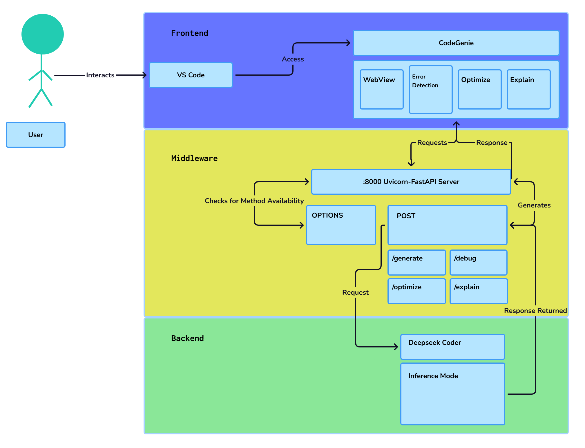
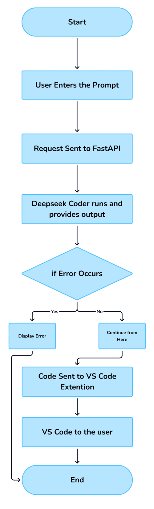

#  CodeGenie — AI-Powered VS Code Extension

**CodeGenie** is a Visual Studio Code extension that integrates generative AI directly into your coding workflow. Designed by developers, for developers — it empowers users with intelligent suggestions, code generation, debugging assistance, and more.

---

# 🚀 Introduction

**CodeGenie** is an AI-powered coding assistant designed to **revolutionize the software development workflow**. Built on top of the powerful **DeepSeek-Coder** models, it brings intelligent, context-aware coding assistance directly into your editor — helping you write better code, faster.

With native **Visual Studio Code integration** and support for a wide range of programming languages and frameworks, CodeGenie enables developers to:

- ✅ **Generate accurate, context-sensitive code suggestions**  
- 🛠️ **Detect and fix errors in real-time**  
- ⚙️ **Refactor and optimize code for performance and clarity**  
- 🌐 **Work seamlessly across technologies**, from web to machine learning

Whether you're prototyping a web app, building data pipelines, or debugging legacy code, CodeGenie empowers you to stay in flow, reduce cognitive load, and focus on what matters most — building great software.

---

# 💡 Use Cases

Here’s how CodeGenie supports developers across domains:

### 🌐 Web Development
- Generate and refine frontend code (HTML, CSS, JavaScript)  
- Build backend services with Node.js, Django, Flask, and more

### 🤖 Machine Learning & Data Science
- Generate model training scripts and evaluation code  
- Create data cleaning, preprocessing, and visualization pipelines

### 🛠️ General Software Engineering
- Automate boilerplate code generation  
- Implement design patterns and follow best practices  
- Refactor and maintain large codebases

### 🐞 Debugging
- Detect bugs and suggest intelligent fixes in real-time  
- Explain code behavior to assist in troubleshooting

### 📘 Learning & Exploration
- Use natural language to explore code functionality  
- Learn programming concepts with contextual examples  

---

## 📐 Architecture Diagram (DeepSeek Coder V2)

  

---

## 🔄 Workflow Diagram

  

---

### 📜 License & Acknowledgments

CodeGenie is released under the **MIT License**, permitting free use, modification, and distribution for personal and commercial purposes.

This project utilizes [DeepSeek-Coder](https://github.com/deepseek-ai/DeepSeek-Coder), which is governed by the **DeepSeek License Agreement Version 1.0 (October 2023)**. This license grants broad rights to use, reproduce, and distribute the model and its derivatives, but also includes important **use-based restrictions** to ensure responsible and lawful usage.

#### Important Use Restrictions from DeepSeek License:

- No use violating applicable laws or infringing third-party rights  
- No military use  
- No generating harmful, false, or inappropriate content  
- No unauthorized dissemination of personal data  
- No discriminatory or harmful uses against individuals or groups  

By using CodeGenie, you agree to comply with all relevant terms of the DeepSeek License, including these use-based restrictions, and assume responsibility for your use of outputs generated via the model.

For full details, please review the [DeepSeek License Agreement](https://github.com/deepseek-ai/DeepSeek-Coder/blob/main/LICENSE-MODEL) and associated documentation.

---

#### 🔗 Repositories

| Project          | Link                                                                                      |
|------------------|-------------------------------------------------------------------------------------------|
| **CodeGenie**      | [github.com/kmitofficial/CodeGenie-G336-PS25](https://github.com/kmitofficial/CodeGenie-G336-PS25)   |
| **DeepSeek-Coder** | [github.com/deepseek-ai/DeepSeek-Coder](https://github.com/deepseek-ai/DeepSeek-Coder)               |

---

## 🙌 Contributors & Milestones

| **Contributors** | **MS1 Presentation** | **Milestone 1** | **MS2 Presentation** | **Milestone 2** |
|------------------|------------------------|------------------|------------------------|------------------|
| [Mahesh Kiran](https://github.com/Mahesh-Kiran) | [PPT](https://docs.google.com/presentation/d/1EoJBs_tgTp9auJ3mwyXGrIqdJsC0PtbT/edit?usp=sharing&ouid=106538531591857830011&rtpof=true&sd=true) | [Drive](https://drive.google.com/file/d/1xfw9SunwAVXpOTAQwrsldIf_fNUCApZS/view?usp=drive_link) | [PPT](https://docs.google.com/presentation/d/14aEfI7hHQ_GZyRWjx_tp3idsh8emBJhi/edit?usp=sharing&ouid=106538531591857830011&rtpof=true&sd=true) | [Youtube](https://youtu.be/lWarovvT_jk) |
| [Krishna Chaitanya](https://github.com/Krishna752006) | [PPT](https://docs.google.com/presentation/d/1BYKYG7jLn7OR7fBxhIoyDjB0ZLVdzyRC/edit?usp=drive_link&ouid=108051438970748661638&rtpof=true&sd=true) | [Drive](https://drive.google.com/file/d/1bj73JlDlgTRHQOKCWK3iCyE_lrKvhYP-/view?usp=sharing) | [PPT](https://docs.google.com/presentation/d/1iIAPWsR53zegriwS_SBoeZ9B5a7dDHFP/edit?usp=drive_link&ouid=108051438970748661638&rtpof=true&sd=true) | [Youtube](https://youtu.be/klt1-3YqaLk) |
| [Sneha](https://github.com/sneha123-reddy) | [PPT](https://1drv.ms/p/c/72d46eb299d280c2/EVZ8KQF4W3FJi-J79TrFVg4BTYbSXec5IBUOmIPW_qdusg?e=SXSYui) | [Youtube](https://youtu.be/v8eRd9m_zjc) | [PPT](https://1drv.ms/p/c/72d46eb299d280c2/EVnea1noLi1Ht0CzaujIMywBuuiXxNTvHUm5mPBWaTeNLQ?e=1OQnWe) | [Youtube](https://youtu.be/wxUi3C49ve8) |
| [AASRITH CODER](https://github.com/AASRITHCODER) | [PPT](https://docs.google.com/presentation/d/1hx0RpEnn4Bo02LyjqoIH4H_-qJsc6RKg/edit?usp=drive_link&ouid=108051438970748661638&rtpof=true&sd=true) | [Drive](https://drive.google.com/file/d/1ZYD-4lAayVCkRBY7v4QpCB50rQpIIG5a/view?usp=drive_link) | [PPT](https://gamma.app/docs/CodeGenie-Your-Brains-Other-Smarter-Coding-Half--mktk9rcq98bcy8l?mode=present#card-76kk308m6hcwdso) | [Youtube](https://www.youtube.com/watch?v=Ty6n4Pm6C_U) |
| [Triveni](https://github.com/AdepuTriveni) | [PPT](https://docs.google.com/presentation/d/1g9xMyrs_GlXpAKrPXTFyQsaiyq3AqpWf/edit?usp=sharing&ouid=112166444433974300257&rtpof=true&sd=true) | [Youtube](https://www.youtube.com/watch?v=J30KbJHL8to) | [PPT](https://docs.google.com/presentation/d/1F9fXYD4_sCn7wCVG4X6DNhSQQa84-TSY/edit?usp=sharing&ouid=112166444433974300257&rtpof=true&sd=true) | [Youtube](https://youtu.be/sm6rf_juJt0?feature=shared) |
| [Lokesh Vasireddy](https://github.com/LokeshVasireddy) | [PPT](https://docs.google.com/presentation/d/1MB5-yGJJu1qPqzd0Qe-SmdQdeK48UlBl/edit?usp=drive_link&ouid=108051438970748661638&rtpof=true&sd=true) | [Drive](https://drive.google.com/file/d/1bsHk2H0xT1xpuwLSEgrrTk13GvCW8Lkg/view) | [PPT](https://docs.google.com/presentation/d/1leSBgHLeoFi6p2D8jReas4tb_CTMhJTU/edit?usp=drive_link&ouid=108051438970748661638&rtpof=true&sd=true) | [Youtube](https://youtu.be/sO_vApfgWSo) |